# Noun Gender Database ER Diagram

## Current Database Structure (As of 2025-08-07)

```mermaid
erDiagram
    words_fr {
        INTEGER id PK
        TEXT english UK
        TEXT translation_1
        TEXT translation_2
        TEXT translation_3
        TEXT gender_1
        TEXT gender_2
        TEXT gender_3
        TEXT fr_search_keyword
        TEXT data_source
        DATETIME verified_at
        INTEGER confidence_score
        BOOLEAN stage_1_basic
        BOOLEAN stage_2_meanings
        TEXT meaning_en
        TEXT meaning_ja
        TEXT meaning_zh
    }

    words_de {
        INTEGER id PK
        TEXT english UK
        TEXT translation_1
        TEXT translation_2
        TEXT translation_3
        TEXT gender_1
        TEXT gender_2
        TEXT gender_3
        TEXT de_search_keyword
        TEXT data_source
        DATETIME verified_at
        INTEGER confidence_score
        BOOLEAN stage_1_basic
        BOOLEAN stage_2_meanings
        TEXT meaning_en
        TEXT meaning_ja
        TEXT meaning_zh
    }

    words_es {
        INTEGER id PK
        TEXT english UK
        TEXT translation_1
        TEXT translation_2
        TEXT translation_3
        TEXT gender_1
        TEXT gender_2
        TEXT gender_3
        TEXT es_search_keyword
        TEXT data_source
        DATETIME verified_at
        INTEGER confidence_score
        BOOLEAN stage_1_basic
        BOOLEAN stage_2_meanings
        TEXT meaning_en
        TEXT meaning_ja
        TEXT meaning_zh
    }

    words_it {
        INTEGER id PK
        TEXT english UK
        TEXT translation_1
        TEXT translation_2
        TEXT translation_3
        TEXT gender_1
        TEXT gender_2
        TEXT gender_3
        TEXT it_search_keyword
        TEXT data_source
        DATETIME verified_at
        INTEGER confidence_score
        BOOLEAN stage_1_basic
        BOOLEAN stage_2_meanings
        TEXT meaning_en
        TEXT meaning_ja
        TEXT meaning_zh
    }

    words_pt {
        INTEGER id PK
        TEXT english UK
        TEXT translation_1
        TEXT translation_2
        TEXT translation_3
        TEXT gender_1
        TEXT gender_2
        TEXT gender_3
        TEXT pt_search_keyword
        TEXT data_source
        DATETIME verified_at
        INTEGER confidence_score
        BOOLEAN stage_1_basic
        BOOLEAN stage_2_meanings
        TEXT meaning_en
        TEXT meaning_ja
        TEXT meaning_zh
    }

    words_ru {
        INTEGER id PK
        TEXT english UK
        TEXT translation_1
        TEXT translation_2
        TEXT translation_3
        TEXT gender_1
        TEXT gender_2
        TEXT gender_3
        TEXT ru_search_keyword
        TEXT data_source
        DATETIME verified_at
        INTEGER confidence_score
        BOOLEAN stage_1_basic
        BOOLEAN stage_2_meanings
        TEXT meaning_en
        TEXT meaning_ja
        TEXT meaning_zh
    }

    words_ar {
        INTEGER id PK
        TEXT english UK
        TEXT translation_1
        TEXT translation_2
        TEXT translation_3
        TEXT gender_1
        TEXT gender_2
        TEXT gender_3
        TEXT ar_search_keyword
        TEXT data_source
        DATETIME verified_at
        INTEGER confidence_score
        BOOLEAN stage_1_basic
        BOOLEAN stage_2_meanings
        TEXT meaning_en
        TEXT meaning_ja
        TEXT meaning_zh
    }

    words_hi {
        INTEGER id PK
        TEXT english UK
        TEXT translation_1
        TEXT translation_2
        TEXT translation_3
        TEXT gender_1
        TEXT gender_2
        TEXT gender_3
        TEXT hi_search_keyword
        TEXT data_source
        DATETIME verified_at
        INTEGER confidence_score
        BOOLEAN stage_1_basic
        BOOLEAN stage_2_meanings
        TEXT meaning_en
        TEXT meaning_ja
        TEXT meaning_zh
    }

    all_words {
        TEXT english
        TEXT language
        TEXT translation_1
        TEXT translation_2
        TEXT translation_3
        TEXT gender_1
        TEXT gender_2
        TEXT gender_3
        TEXT meaning_en
        TEXT meaning_ja
        TEXT meaning_zh
    }

    %% View relationships
    words_fr ||--o{ all_words : "UNION ALL"
    words_de ||--o{ all_words : "UNION ALL"
    words_es ||--o{ all_words : "UNION ALL"
    words_it ||--o{ all_words : "UNION ALL"
    words_pt ||--o{ all_words : "UNION ALL"
    words_ru ||--o{ all_words : "UNION ALL"
    words_ar ||--o{ all_words : "UNION ALL"
    words_hi ||--o{ all_words : "UNION ALL"
```

## Field Descriptions

### Common Fields (All Language Tables)
- **id**: Primary key, auto-incrementing integer
- **english**: English word (unique within each table)
- **translation_1-3**: Up to 3 translations in the target language
- **gender_1-3**: Gender for each translation (m/f/n)
- **[lang]_search_keyword**: Search keywords specific to each language
- **data_source**: Source of the data ('original', 'llm_verified', 'manual_correction')
- **verified_at**: Timestamp of last verification
- **confidence_score**: Confidence level (0-100)
- **stage_1_basic**: Boolean flag for basic translation completion
- **stage_2_meanings**: Boolean flag for meaning definition completion
- **meaning_en**: English meaning definition
- **meaning_ja**: Japanese meaning definition
- **meaning_zh**: Chinese meaning definition

### View: all_words
A UNION ALL view that combines all language tables for cross-language queries.

## Proposed Extensions (Phase 2.5)

## Database Statistics (As of 2025-08-07)
- Total English words: 4,541
- Languages supported: 8 (French, German, Spanish, Italian, Portuguese, Russian, Arabic, Hindi)
- Meaning definitions completed: 1,517 (33.4%)
- Empty translations needing completion:
  - Arabic: 1,491
  - Hindi: 480
  - Other languages: Various counts

## Notes
1. Each language has its own table with identical structure
2. The `all_words` view provides a unified interface for querying across languages
3. Data quality improvements are tracked through stage flags and timestamps
4. The database uses SQLite with file: `data/noun_gender.db`