# Noun Gender Database ER Diagram

## Updated Database Structure (As of 2025-08-08)

```mermaid
erDiagram
    %% Core Tables
    words_en {
        INTEGER id PK
        TEXT en UK "English word"
    }

    word_meanings {
        INTEGER id PK
        TEXT en UK "English word"
        TEXT meaning_en "English definition"
        TEXT meaning_ja "Japanese definition"
        TEXT meaning_zh "Chinese definition"
    }

    examples {
        INTEGER id PK
        TEXT en UK "English word"
        TEXT example_en "English example sentence"
    }

    example_translations {
        INTEGER id PK
        TEXT example_en "English example"
        TEXT lang "Language code"
        TEXT translation "Translated example"
    }

    memory_tricks {
        INTEGER id PK
        TEXT en "English word"
        TEXT translation_lang "Target language"
        TEXT ui_lang "UI language"
        TEXT trick_text "Memory trick text"
    }

    %% Language Tables
    words_ar {
        INTEGER id PK
        TEXT en "English word"
        TEXT translation "Arabic translation"
        TEXT gender "m/f/n"
        NUMERIC verified_at
        INTEGER confidence_score
    }

    words_fr {
        INTEGER id PK
        TEXT en "English word"
        TEXT translation "French translation"
        TEXT gender "m/f/n"
        NUMERIC verified_at
        INTEGER confidence_score
    }

    words_de {
        INTEGER id PK
        TEXT en "English word"
        TEXT translation "German translation"
        TEXT gender "m/f/n"
        NUMERIC verified_at
        INTEGER confidence_score
    }

    words_hi {
        INTEGER id PK
        TEXT en "English word"
        TEXT translation "Hindi translation"
        TEXT gender "m/f/n"
        NUMERIC verified_at
        INTEGER confidence_score
    }

    words_it {
        INTEGER id PK
        TEXT en "English word"
        TEXT translation "Italian translation"
        TEXT gender "m/f/n"
        NUMERIC verified_at
        INTEGER confidence_score
    }

    words_pt {
        INTEGER id PK
        TEXT en "English word"
        TEXT translation "Portuguese translation"
        TEXT gender "m/f/n"
        NUMERIC verified_at
        INTEGER confidence_score
    }

    words_ru {
        INTEGER id PK
        TEXT en "English word"
        TEXT translation "Russian translation"
        TEXT gender "m/f/n"
        NUMERIC verified_at
        INTEGER confidence_score
    }

    words_es {
        INTEGER id PK
        TEXT en "English word"
        TEXT translation "Spanish translation"
        TEXT gender "m/f/n"
        NUMERIC verified_at
        INTEGER confidence_score
    }

    %% Views
    v_all_translations {
        TEXT en "English word"
        TEXT meaning_en
        TEXT meaning_ja
        TEXT meaning_zh
        TEXT lang "Language code"
        TEXT translation
        TEXT gender
        NUMERIC verified_at
        INTEGER confidence_score
    }

    v_multilingual_search {
        INTEGER id "Generated ID"
        TEXT search_term "Lowercase search term"
        TEXT en "English word"
        TEXT lang "Language code"
        TEXT translation
        TEXT match_type "exact/english"
        DATETIME created_at
    }

    v_search_ready {
        TEXT search_term
        TEXT en
        TEXT lang
        TEXT translation
        TEXT match_type
        TEXT meaning_en
        TEXT meaning_ja
        TEXT meaning_zh
        TEXT gender
    }

    v_statistics {
        TEXT table_name
        INTEGER record_count
    }

    %% Foreign Key Relationships
    words_en ||--o{ word_meanings : "en"
    words_en ||--o{ examples : "en"
    words_en ||--o{ memory_tricks : "en"
    words_en ||--o{ words_ar : "en"
    words_en ||--o{ words_fr : "en"
    words_en ||--o{ words_de : "en"
    words_en ||--o{ words_hi : "en"
    words_en ||--o{ words_it : "en"
    words_en ||--o{ words_pt : "en"
    words_en ||--o{ words_ru : "en"
    words_en ||--o{ words_es : "en"

    examples ||--o{ example_translations : "example_en"

    %% View Dependencies
    words_en ||--o{ v_all_translations : "UNION source"
    word_meanings ||--o{ v_all_translations : "LEFT JOIN"
    words_ar ||--o{ v_all_translations : "UNION ALL"
    words_fr ||--o{ v_all_translations : "UNION ALL"
    words_de ||--o{ v_all_translations : "UNION ALL"
    words_hi ||--o{ v_all_translations : "UNION ALL"
    words_it ||--o{ v_all_translations : "UNION ALL"
    words_pt ||--o{ v_all_translations : "UNION ALL"
    words_ru ||--o{ v_all_translations : "UNION ALL"
    words_es ||--o{ v_all_translations : "UNION ALL"

    v_all_translations ||--o{ v_multilingual_search : "Auto-generated search index"
    v_multilingual_search ||--o{ v_search_ready : "Enhanced with meanings"
```

## Key Improvements (2025-08-08 Refactoring)

### 1. Normalized Schema
- **Single source of truth**: `words_en` table contains all English words
- **Separate concerns**: Meanings, examples, and tricks in dedicated tables
- **Referential integrity**: All tables linked via foreign keys

### 2. Consistent Naming
- **Column standardization**: `english` → `en`, `language_code` → `lang`
- **View naming**: All views prefixed with `v_`
- **Clear relationships**: FK constraints maintain data consistency

### 3. Auto-Maintenance
- **`v_multilingual_search`**: Dynamic view replacing static table
- **Self-updating**: Search index automatically reflects data changes
- **No manual sync**: Eliminates maintenance overhead

### 4. Performance Optimization
- **Strategic indexes**: On `en`, `lang`, `gender` columns
- **Efficient views**: Optimized JOIN patterns
- **Constraint checks**: Database-level validation

## Database Statistics (As of 2025-08-08)

| Table/View | Records | Purpose |
|------------|---------|---------|
| v_multilingual_search | 35,012 | Auto-generated search index |
| words_en | 4,651 | Master English word list |
| words_fr | 4,449 | French translations |
| words_de | 4,433 | German translations |
| words_it | 4,408 | Italian translations |
| words_es | 4,408 | Spanish translations |
| words_ru | 4,325 | Russian translations |
| words_hi | 4,061 | Hindi translations |
| word_meanings | 3,918 | Multilingual definitions (84.2%) |
| words_ar | 3,050 | Arabic translations |
| words_pt | 1,227 | Portuguese translations |
| memory_tricks | 18 | Mnemonic aids |
| example_translations | 10 | Translated examples |
| examples | 1 | English examples |

## Technical Features

### Foreign Key Constraints
- **CASCADE deletion**: Removing English word deletes all translations
- **Data integrity**: Prevents orphaned records
- **Consistent updates**: Changes propagate automatically

### View Architecture
1. **`v_all_translations`**: Core unified data view
2. **`v_multilingual_search`**: Dynamic search index (replaces table)
3. **`v_search_ready`**: API-optimized search results
4. **`v_statistics`**: System metrics and counts

### Indexing Strategy
- Primary keys on all `id` columns
- Unique indexes on `en` columns
- Performance indexes on `lang` and `gender`
- Search optimization on `search_term`

## Migration Benefits
- ✅ **Zero maintenance**: Search indexes update automatically
- ✅ **Data integrity**: Foreign key constraints prevent corruption
- ✅ **Performance**: Optimized indexes and view structure
- ✅ **Consistency**: Standardized naming and relationships
- ✅ **Scalability**: Normalized schema supports growth

## API Compatibility
The database restructure maintains full API compatibility while providing:
- Improved query performance
- Automatic search index updates
- Better data validation
- Simplified maintenance workflows