# Noun Gender Database ER Diagram

## Database Structure (Cloudflare D1 - Updated 2025-12-26)

```mermaid
erDiagram
    %% Core Tables
    words_en {
        INTEGER id PK
        TEXT en UK "English word"
    }

    word_meanings {
        INTEGER id PK
        TEXT en UK "English word"
        TEXT meaning_en "English definition"
        TEXT meaning_ja "Japanese definition"
        TEXT meaning_zh "Chinese definition"
        TEXT meaning_fr "French definition"
        TEXT meaning_de "German definition"
        TEXT meaning_es "Spanish definition"
        TEXT meaning_it "Italian definition"
        TEXT meaning_pt "Portuguese definition"
        TEXT meaning_ru "Russian definition"
        TEXT meaning_ar "Arabic definition"
        TEXT meaning_hi "Hindi definition"
    }

    examples {
        INTEGER id PK
        TEXT en UK "English word"
        TEXT example_en "English example sentence"
    }

    example_translations {
        INTEGER id PK
        TEXT example_en "English example"
        TEXT lang "Language code"
        TEXT translation "Translated example"
    }

    memory_tricks {
        INTEGER id PK
        TEXT en "English word"
        TEXT translation_lang "Target language"
        TEXT ui_lang "UI language"
        TEXT trick_text "Memory trick text"
    }

    %% Language Tables (8 languages)
    words_ar {
        INTEGER id PK
        TEXT en "English word"
        TEXT translation "Arabic translation"
        TEXT gender "m/f/n"
        NUMERIC verified_at
        INTEGER confidence_score
    }

    words_fr {
        INTEGER id PK
        TEXT en "English word"
        TEXT translation "French translation"
        TEXT gender "m/f/n"
        NUMERIC verified_at
        INTEGER confidence_score
    }

    words_de {
        INTEGER id PK
        TEXT en "English word"
        TEXT translation "German translation"
        TEXT gender "m/f/n"
        NUMERIC verified_at
        INTEGER confidence_score
    }

    words_hi {
        INTEGER id PK
        TEXT en "English word"
        TEXT translation "Hindi translation"
        TEXT gender "m/f/n"
        NUMERIC verified_at
        INTEGER confidence_score
    }

    words_it {
        INTEGER id PK
        TEXT en "English word"
        TEXT translation "Italian translation"
        TEXT gender "m/f/n"
        NUMERIC verified_at
        INTEGER confidence_score
    }

    words_pt {
        INTEGER id PK
        TEXT en "English word"
        TEXT translation "Portuguese translation"
        TEXT gender "m/f/n"
        NUMERIC verified_at
        INTEGER confidence_score
    }

    words_ru {
        INTEGER id PK
        TEXT en "English word"
        TEXT translation "Russian translation"
        TEXT gender "m/f/n"
        NUMERIC verified_at
        INTEGER confidence_score
    }

    words_es {
        INTEGER id PK
        TEXT en "English word"
        TEXT translation "Spanish translation"
        TEXT gender "m/f/n"
        NUMERIC verified_at
        INTEGER confidence_score
    }

    %% Foreign Key Relationships
    words_en ||--o{ word_meanings : "en"
    words_en ||--o{ examples : "en"
    words_en ||--o{ memory_tricks : "en"
    words_en ||--o{ words_ar : "en"
    words_en ||--o{ words_fr : "en"
    words_en ||--o{ words_de : "en"
    words_en ||--o{ words_hi : "en"
    words_en ||--o{ words_it : "en"
    words_en ||--o{ words_pt : "en"
    words_en ||--o{ words_ru : "en"
    words_en ||--o{ words_es : "en"

    examples ||--o{ example_translations : "example_en"
```



## Architecture (2025-12-26 Update)

### No Views - Direct Table Queries

D1のUNION ALL制限（約4-5項まで）を回避するため、ビューを使用しない設計を採用:

```typescript
// 例: 全言語から翻訳を取得
const ALL_LANGUAGES = ['ar', 'fr', 'de', 'hi', 'it', 'pt', 'ru', 'es'] as const;

for (const lang of ALL_LANGUAGES) {
  const { results } = await db
    .prepare(`SELECT en, translation, gender FROM words_${lang} WHERE ...`)
    .all();
  // 結果をSetやMapで統合
}
```

### Query Strategy

1. **個別クエリ**: 各言語テーブル (`words_fr`, `words_de`, etc.) を個別にクエリ
2. **JavaScript統合**: 結果を `Set<string>` や `Map<string, T>` で統合
3. **アプリ層ソート**: ソート・フィルタリングはJavaScript側で実行

### Benefits

- **D1互換**: UNION ALL制限を完全回避
- **シンプル**: ビューの管理が不要
- **柔軟**: 言語の追加が容易

## Database Statistics

| Table | Records | Purpose |
|-------|---------|---------|
| words_en | 4,651 | Master English word list |
| words_fr | 4,449 | French translations |
| words_de | 4,433 | German translations |
| words_it | 4,408 | Italian translations |
| words_es | 4,408 | Spanish translations |
| words_ru | 4,325 | Russian translations |
| words_hi | 4,061 | Hindi translations |
| word_meanings | 3,918 | Multilingual definitions (84.2%) |
| words_ar | 3,050 | Arabic translations |
| words_pt | 1,227 | Portuguese translations |
| memory_tricks | 18 | Mnemonic aids |
| example_translations | 10 | Translated examples |
| examples | 1 | English examples |

## Technical Features

### Indexing Strategy
- Primary keys on all `id` columns
- Unique indexes on `en` columns
- Performance indexes on `translation` and `gender`

### Data Integrity
- Foreign key constraints via `en` column
- Consistent naming: `en` for English word, `lang` for language code
- Valid gender values: `m`, `f`, `n`

## Deployment

- **Platform**: Cloudflare Pages + D1
- **Database ID**: `b77966ed-35c3-4fc8-a649-fea43e085708`
- **Database Name**: `noun-gender-db`
