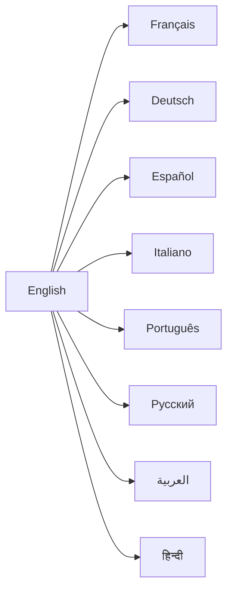
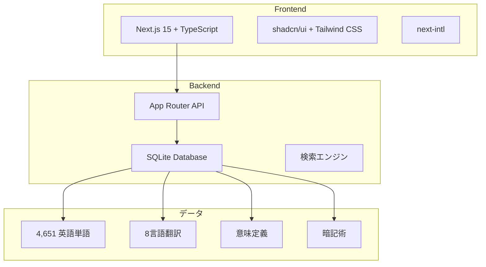
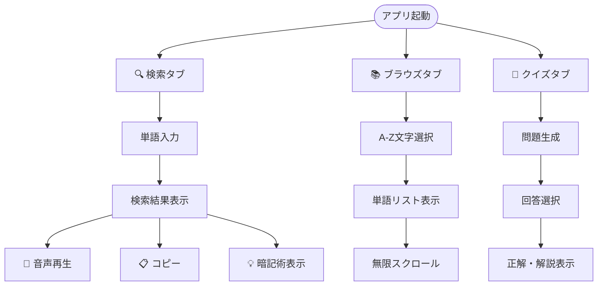
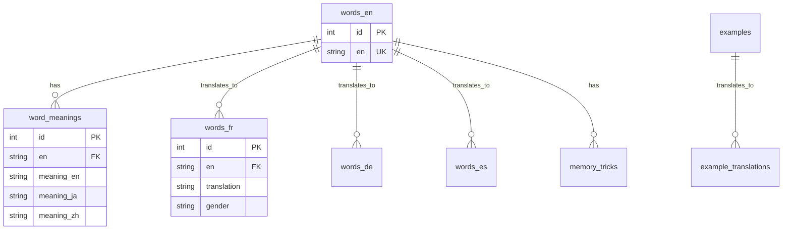

# Noun Gender - 名詞性別学習アプリ

名詞に性別のある言語（フランス語、ドイツ語、スペイン語など）の学習・検索用Webアプリケーション。
4,651語の多言語データベースで、効率的な語学学習をサポートします。


## 🌟 主な機能

- **🔍 多言語検索**: 8言語対応のインクリメンタル検索
- **📚 A-Z辞書ブラウズ**: アルファベット索引による単語閲覧
- **🎯 性別クイズ**: インタラクティブな学習ゲーム
- **🎵 音声読み上げ**: Web Speech APIによるネイティブ発音
- **💡 暗記術**: 性別を覚えるためのヒント機能
- **🌙 テーマ切り替え**: Solarizedダーク/ライトモード
- **🌍 多言語UI**: 11言語対応のユーザーインターフェース

## 🗣️ 対応言語



**翻訳データ**: 30,361件 | **意味定義**: 3,918語 (84%完了)

## 🏗️ アーキテクチャ



## 🚀 クイックスタート

### 必要環境
- Node.js 18+
- npm または yarn

### インストール・起動

```bash
# リポジトリクローン
git clone <repository-url>
cd noun-gender

# 依存関係インストール
npm install

# 開発サーバー起動
npm run dev

# ブラウザでアクセス
# http://localhost:3000
```

### ビルド・デプロイ

```bash
# 本番ビルド
npm run build

# 本番サーバー起動
npm start

# 型チェック
npm run typecheck
```

## 📱 使用方法

### 基本操作



### キーボードショートカット

| キー | 機能 |
|-----|------|
| `/` | 検索フィールドにフォーカス |
| `Esc` | 検索クリア |
| `Enter` | 検索実行・回答送信 |

## 🗄️ データベース

正規化されたSQLiteデータベース構造：



## 📊 開発状況

現在の進捗状況（2025-08-08時点）:

- ✅ **基盤構築完了**: Next.js + SQLite + API
- ✅ **UI実装完了**: 検索・ブラウズ・クイズ機能
- ✅ **データベース正規化完了**: FK制約・自動インデックス
- 🔄 **意味定義補完中**: 84% (3,918/4,651語) 
- 🎯 **次期計画**: 例文機能拡充・品質改善

## 📄 ドキュメント

- **[プロジェクト概要](CLAUDE.md)**: 全体ナビゲーション
- **[API仕様書](docs/api.md)**: エンドポイント詳細
- **[システム設計](docs/architecture.md)**: 技術アーキテクチャ
- **[UI設計](docs/ui-spec.md)**: デザインシステム
- **[作業進捗](.claude/tasks.md)**: 開発ステータス

## 🤝 コントリビューション

プロジェクトへの貢献を歓迎します！

1. フォーク
2. フィーチャーブランチ作成 (`git checkout -b feature/amazing-feature`)
3. コミット (`git commit -m 'Add amazing feature'`)
4. プッシュ (`git push origin feature/amazing-feature`)
5. プルリクエスト作成

## 📜 ライセンス

このプロジェクトは MIT ライセンスの下で公開されています。

---

**作者**: kako-jun  
**開発**: Next.js 15 + TypeScript + SQLite  
**最終更新**: 2025-08-08